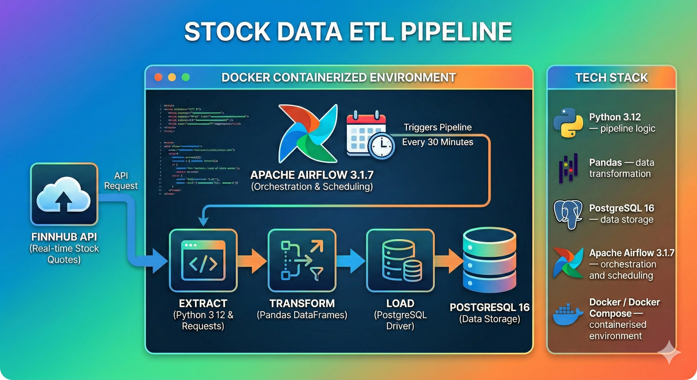

# Hi, I'm Tiago 👋
**MSc. Data Science Student | BSc. Mechanical Engineering**

I am a Data Science student currently in the 2nd year (Expected Completion: Sep 2026).

This portfolio showcases my engineering projects beyond the academic scope!

**Core Interests:** Data Engineering & Machine Learning

  <a href="https://www.linkedin.com/in/tiago-pereira-6284041a4/"><b>LinkedIn</b></a>

---

## ⚡ Technical Skills

| **Domain** | **Tools & Frameworks** |
| :--- | :--- |
| **Data Engineering** | SQL, Python, Airflow, PostgreSQL, Docker, docker-compose |
| **Machine Learning** | TensorFlow, Time Series Analysis, Pandas, Scikit-Learn |
| **Cloud & Others** | AWS Lambda, FastAPI, Docker, Telegram API |

---

## 🛠 Projects

### 1. Basic Stock Data ETL Pipeline
**The Challenge:** Build a ETL pipeline for data that pulls market data from the Finnhub API every 30 minutes and saves it to a PostgreSQL database using Apache Airflow for orchestration, scheduling and monitoring, and Docker for conteinerization.

* **Ingestion (Finnhub API)**: Automated data extraction from Finnhub on a 30-minute cadence, handling request/response parsing and preparing records for downstream processing.
* **Orchestration (Apache Airflow)**: Implemented an Airflow DAG to coordinate the full workflow (extract → transform → load), with clear task boundaries, retries, and execution tracking via the Airflow UI.
* **Transformation & Data Quality**: Added cleaning steps to ensure consistent schemas and types (e.g., timestamps, numeric fields), making the dataset ready for querying and analytics.
* **Storage (PostgreSQL)**: Loaded processed data into PostgreSQL.
* **Containerization (Docker / Compose)**: Containerized the stack so the entire pipeline can be spun up with minimal setup, ensuring consistent dependencies across environments.
* **Git & GitHub:** For version control.

[View Basic Stock Data ETL Pipeline Repository](https://github.com/tiagomdpereira/stock_data_airflow_postgresql)

 

### 2. Ultra-Low Latency Keyword Spotting (TinyML)
**The Challenge:** Deploy a real-time voice activation model on a battery-powered microcontroller with severe RAM constraints.

* **Signal Processing:** Implemented a pipeline to convert raw audio into **MFCC spectrograms**, treating sound as a visual pattern for the model.
* **Model Architecture:** Adapted **MobileNetV1-based DS-CNN** and **MobileNetV2** architectures, specifically optimized for the **Arduino Nano 33 BLE Sense**.
* **Optimization:** Applied **Post-training Quantization (Int8)** to compress the model without losing critical information.
* **Result:** Achieved **94.1% test accuracy**with a final model size of just **82KB** (fitting easily within the 256KB RAM limit).

[View Ultra-Low Latency Keyword Spotting Project Page](https://github.com/tiagomdpereira/keyword-spotting-edge-ai)

 

### 3. Serverless Notification System
**The Challenge:** Architect a zero-maintenance, low-cost infrastructure to handle alerts from edge devices.

* **Architecture:** Built a scalable, event-driven backend using **AWS Lambda** (Serverless).
* **Integration:** Connected system triggers to a **Telegram Bot** via API for instant mobile alerts.
* **Result:** On the last Thursday of every month, I get a Telegram message reminding me to pay my karate bill.

[View Article Serverless Reminder System](https://medium.com/@tiagomdpereira/how-to-create-a-reminder-telegram-bot-with-aws-lambda-aws-eventbridge-and-python-fc5a676d4c42)
